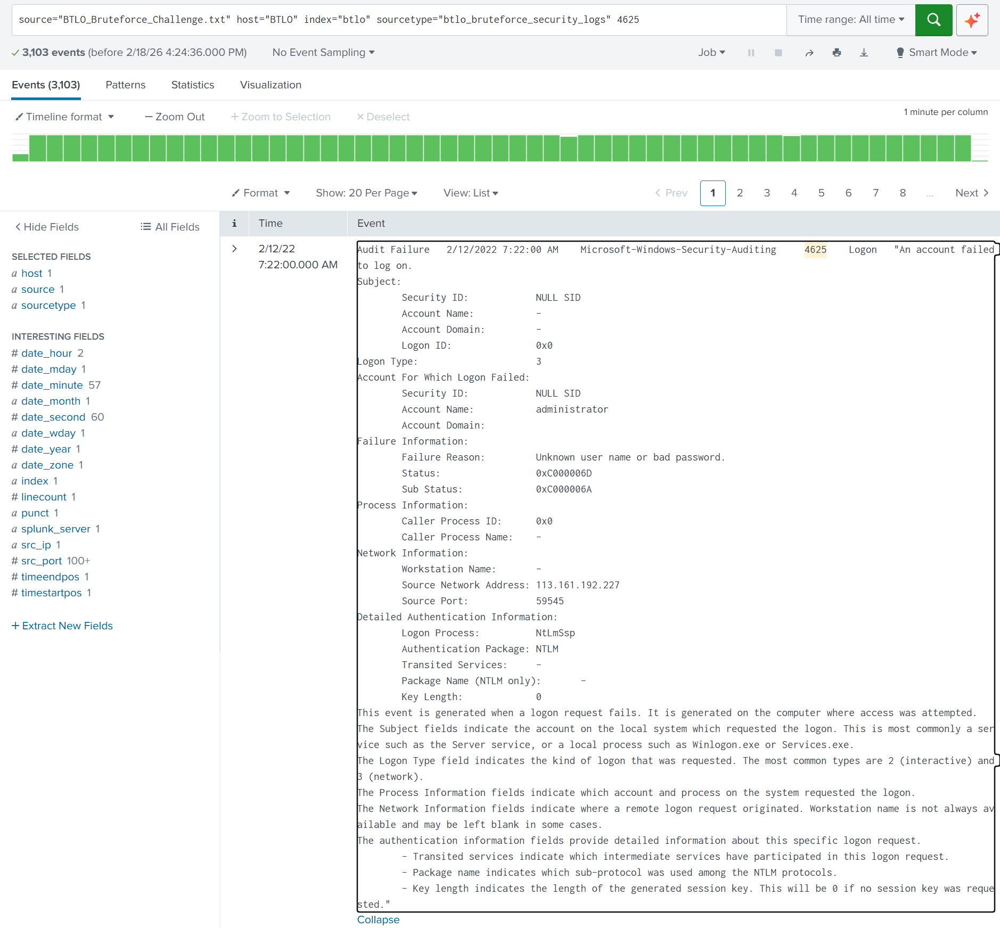

# Brute Force Attack Log Analysis

**Logs Source:** Blue Team Labs Online – Bruteforce Challenge  

---

## Scenario

One of our system administrators identified a large number of Audit Failure events in the Windows Security Event log. The task is to analyze logs from an attempted RDP brute-force attack, identify the attacker’s source IP and source ports, and summarize failed login patterns.

---

## Analysis

The raw logs were ingested into Splunk for analysis, allowing automatic parsing of the multi-line text file.

Initial review showed a high volume of failed authentication attempts, so the investigation focused on **Windows Event ID 4625 (Failed Logon)**.

Key findings:
- **3103** failed login attempts  
- Target account: **administrator**  
- Failure reason: **Unknown user name or bad password**




---

## Field Extraction

Because the logs were multi-line text, the Splunk UI field extractor was not effective. Custom regex-based field extraction was used instead.

### Source IP Extraction
```regex
Source Network Address:\s+(?<src_ip>\d{1,3}\.\d{1,3}\.\d{1,3}\.\d{1,3})
```
### Source Port Extraction
```regex
Source Port:\s+(?<src_port>\d+)
```

---

## Threat Intelligence

Using AbuseIPDB, the attacker’s IP address (133.161.192.227) was found to be associated with Vietnam, indicating an external malicious actor.


---

## Attack Behavior

Analysis of the extracted source ports using Splunk’s stats command indicate the attacker used ports in the range 49162-65534 in about 55 minutes. This is consistent with automated brute-force attempts.

### Port Range:
```SPL
source="BTLO_Bruteforce_Challenge.txt" host="BTLO" index="btlo" sourcetype="btlo_bruteforce_security_logs"
| stats max(src_port) as HighestPort, min(src_port) as LowestPort
```


### Time Elapsed
```SPL
source="BTLO_Bruteforce_Challenge.txt" host="BTLO" index="btlo" sourcetype="btlo_bruteforce_security_logs"
| stats count min(_time) as first_attempt max(_time) as last_attempt by src_ip
| eval duration_minutes=(last_attempt-first_attempt)/60
```


---

## SOC-Relevant Insights/Recommendations:

Implement a firewall or IPS rules to block traffic from the malicious IP.

Create alerts for repeated Windows Event ID 4625 failures to detect future attacks.

Monitor for unusual source ports during login attempts to catch automated attack tools early.

---

## Conclusion:

This analysis demonstrates end-to-end SOC investigation skills: raw log ingestion, regex field extraction for multi-line logs, SPL analysis, and integration with threat intelligence to identify and contextualize malicious activity.


